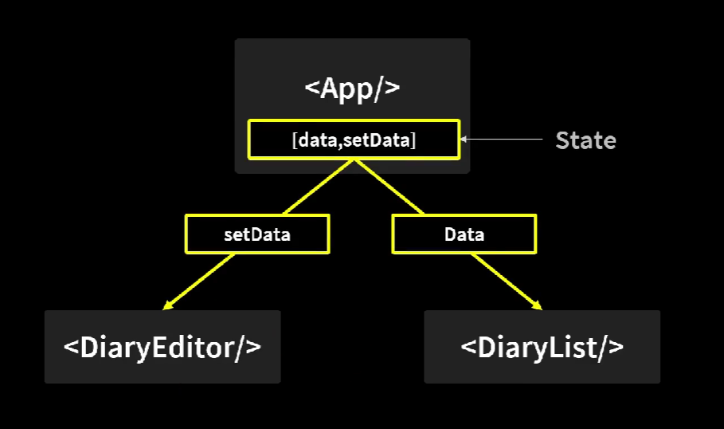

# TIL 230314(화)

- React
    - state 팁
        - 비슷한 용도로 사용되는 state는 객체로 묶어 사용하는 것이 좋음
            ```javascript
            // author와 content 모두 일기의 내용이고 비슷한 용도로 사용되기 때문에 객체로 묶음
            const DiaryEditor = () => {
                const [state, setState] = useState({ author: "", content: "" });

                function changeAuthor(e) {
                setState({ ...state, author: e.target.value });
                console.log(state.author);
                }

                function changeContent(e) {
                setState({ ...state, content: e.target.value });
                console.log(state.content);
                }

                return (
                <div className="DiaryEditor">
                    <h2>오늘의 일기</h2>
                    <div>
                    <input
                        value={state.author}
                        onChange={changeAuthor}
                        placeholder="오늘 하루는 어땠나요?"
                    />
                    </div>
                    <div>
                    <textarea
                        value={state.content}
                        onChange={changeContent}
                        placeholder="여기에 내용을 입력해주세요."
                    />
                    </div>
                </div>
                );
            };
            ```
            ```javascript
            // 이런 식으로 onChange 함수도 합칠 수 있음
            const DiaryEditor = () => {
                const [state, setState] = useState({ author: "", content: "" });

                const handleChangeState = (e) => {
                setState({ ...state, [e.target.name]: e.target.value });
                };

                return (
                <div className="DiaryEditor">
                    <h2>오늘의 일기</h2>
                    <div>
                    <input
                        name="author"
                        value={state.author}
                        onChange={handleChangeState}
                        placeholder="오늘 하루는 어땠나요?"
                    />
                    </div>
                    <div>
                    <textarea
                        name="content"
                        value={state.content}
                        onChange={handleChangeState}
                        placeholder="여기에 내용을 입력해주세요."
                    />
                    </div>
                </div>
                );
            };
            ```
        - spread 연산자(위 코드에서 사용된 ...state)는 기존에 있던 데이터를 변경하려면 맨앞에 써야 함. 변경하고자 하는 값 뒤에 사용하면 변경하고자 하는 값을 덮어써서 원하는 결과가 나오지 않음. 데이터를 새로 추가하는 경우엔 뒤에 써도 됨
    - **useRef**
        - 특정 DOM을 선택하는 React의 Hook 함수
        - javascript의 getElementById, querySelector와 같은 역할
        - useRef()의 반환값인 React.MutableRefObject는 HTML DOM 요소에 접근할 수 있게 함
        - 현재 가리키는 값을 current로 불러와 사용함
        - **useRef로 컴포넌트 안의 변수 만들기**
            - useRef로 컴포넌트 안에서 조회 및 수정할 수 있는 변수를 만들 수 있음
            - useRef는 변수의 값이 바뀌어도 컴포넌트가 리렌더링되지 않고 설정 후 바로 조회할 수 있음
            - 반면에, state는 state를 바꾸는 함수를 호출한 뒤 렌더링 이후 업데이트된 상태를 조회할 수 있음
                ```javascript
                // 데이터를 입력하면 state인 data를 업데이트하는 함수
                // useRef로 초기값이 0인 변수를 생성하여 id값으로 사용함
                const [data, setData] = useState([]);
                const dataId = useRef(0);

                const onCreate = (author, content, emotion) => {
                    const created_date = new Date().getTime();
                    const newItem = {
                    author,
                    content,
                    emotion,
                    created_date,
                    id: dataId.current,
                    };
                    dataId.current += 1;
                    setData([newItem, ...data]);
                };
                ```
    - React 컴포넌트의 lifecycle
        - 탄생
            - 컴포넌트가 화면에 나타남 -> Mount
        - 변화
            - 업데이트(리렌더) -> Update
        - 죽음
            - 화면에서 사라짐 -> UnMount
    - React Hooks
        - state, effect, ref 등의 클래스형 컴포넌트에서 사용하는 기술을 useState, useEffect, useRef와 같은 함수형으로 만들어서 함수형 컴포넌트에서 사용함
        - 함수형 컴포넌트를 쓰는 이유?
            - 클래스형 컴포넌트는 코드 길이가 길어지는 문제가 있음
            - 중복 코드, 가독성 문제 등을 해결하기 위해 함수형 컴포넌트가 등장함
    - React Hooks(useEffect)를 이용한 함수형 컴포넌트의 lifecycle 제어
        - useEffect 파라미터 : callback 함수, 의존성 배열
        - 의존성 배열에 들어있는 값이 변화하면 callback 함수가 실행됨
        - (Mount)의존성 배열이 빈 배열일 경우, callback 함수는 mount 때만 동작함
        - (Update)의존성 배열을 전달하지 않을 경우 컴포넌트가 update 될 때마다 callback 함수가 동작함
        - (UnMount)callback 함수가 함수를 return할 경우, 컴포넌트가 unmount가 되면 그 리턴한 함수가 동작함
---

## 이슈

1. javascript 객체를 생성할 때 key를 변수로 생성하는 법
    - 대괄호에 넣어 사용가능함

        ```javascript
        const name = "username";
        const age = 20;

        const info = {
        [name]: age,
        };
        ```
2. javascript 화살표 함수
    - 화살표 함수의 경우 괄호()로 감싸진 부분이 return됨
    - 중괄호{}로 감싸졌을 경우엔 return문이 없으면 return값을 반환하지 않음
        ```javascript
        // button을 리턴함
        const Button = () => (
            <button>Hello world</button>
        )
        ```
        ```javascript
        /// Button은 리턴값이 없어서 undefined임
        const Button = () => {
        <button>Hello world</button>;
        };
        ```
3. React에서 같은 레벨의 컴포넌트끼리 데이터를 주고 받는 법
    - react는 부모 컴포넌트 -> 자식 컴포넌트의 방식으로 위에서 아래로만 데이터를 넘겨줄 수 있음(**단방향 데이터 흐름**)
    - 따라서 같은 레벨의 컴포넌트끼리 데이터를 주고 받으려면 해당 컴포넌트들의 공통 부모 컴포넌트에 state를 만들어 사용함
        
        - DiaryEditor에서 수정한 data를 DiaryList에서 받을 수 있음
4. React Mount 두 번 발생함
    ```javascript
    useEffect(() => {
        console.log("Mount!");
    }, []);
    ```
    - 위의 코드가 들어있는 컴포넌트를 새로고침했을 때 두 번의 "Mount!"가 출력됨
    - 이유      
        - index.js에서 App 컴포넌트가 <React.StrictMode>로 감싸여 있기 때문    
        strict mode는 react 개발 도중 발생하는 문제를 감지하기 위한 설정으로 해당 설정 시 렌더링이 두 번 발생하게 됨
            > 참고   
            https://www.inflearn.com/questions/510296/mount%EA%B0%80-%EB%91%90%EB%B2%88-%EC%8B%A4%ED%96%89%EB%90%98%EB%8A%94%EA%B1%B4-%EC%99%9C-%EA%B7%B8%EB%9F%B4%EA%B9%8C%EC%9A%94    

            > React Strict mode에 대한 설명    
            https://ko.reactjs.org/docs/strict-mode.html
---
## 출처

- 인프런 강의(한입 크기로 잘라 먹는 리액트(React.js) : 기초부터 실전까지)
- (useRef) https://react.vlpt.us/basic/10-useRef.html
- (useRef 변수) https://react.vlpt.us/basic/12-variable-with-useRef.html
- (이슈1) https://koonsland.tistory.com/146
- (이슈2) https://velog.io/@bigbrothershin/JavaScript-%ED%99%94%EC%82%B4%ED%91%9C-%ED%95%A8%EC%88%98-%EC%82%AC%EC%9A%A9-%EC%8B%9C-%EC%99%80-%EC%82%AC%EC%9A%A9%EC%83%81-%EC%A3%BC%EC%9D%98%ED%95%A0-%EC%A0%90
