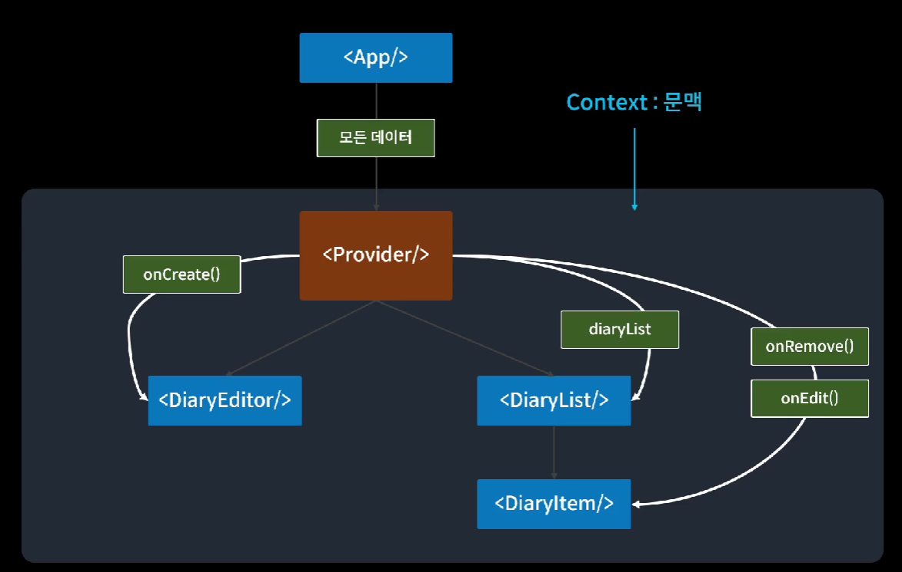

# TIL 230315(수)

- React useState의 함수형 업데이트
    - useState의 setState는 비동기로 동작함
        ```javascript
        const [value, setValue] = useState(0);

        const onClick = () => {
            setValue(value+1);
            setValue(value+1);
            setValue(value+1);
        }
        ```
        - onClick 함수를 실행하면 value는 1이 됨
        - react가 효율적으로 렌더링하기 위해 여러 개의 상태 값 변경 요청을 일괄 처리(batch)하기 때문임
        - 따라서 setState는 변경된 사항을 기억하지 않기 때문에 마지막 업데이트만 적용되어 렌더링에 쓰이게 됨
        - setState를 동기적으로 사용하기 위해서는 함수형 업데이트를 해야 함
    - useState 함수형 업데이트
        - setState에 값을 그대로 전달하지 않고 함수를 전달하는 방법
        ```javascript
        const [value, setValue] =  useState(0)

        const onClick = () => {
            setValue(prev => prev+1)
            setValue(prev => prev+1)
            setValue(prev => prev+1)
        }
        ```
        - 함수형 업데이트는 업데이트된 값을 저장하기 때문에 여러 번의 업데이트가 적용되어 다음 렌더링에 사용됨
        - 전달받은 여러 개의 함수들이 순서대로 실행되면서 최신의 state를 유지한다는 의미
- React useCallback 사용 예시
    ```javascript
    const onCreate = useCallback((author, content, emotion) => {
        const created_date = new Date().getTime();
        const newItem = {
            author,
            content,
            emotion,
            created_date,
            id: dataId.current,
        };
        dataId.current += 1;
        setData((data) => [newItem, ...data]);
    }, []);
    ```
    - 첫 번째 파라미터는 callback 함수, 두 번째 파라미터는 dependency
    - dependency가 빈 배열이므로 mount될 때 한 번만 callback함수를 생성하여 onCreate에 저장함 
    - setDate를 그냥 사용하면 data값이 항상 mount되었을 때의 값으로 유지되기 때문에 data를 최신 상태로 유지하기 위해 함수형 업데이트를 사용함
- 복잡한 상태변화 로직을 컴포넌트에서 분리하기 - **useReducer**
    - useReducer는 useState처럼 state를 관리하고 업데이트할 수 있음 
    - (state, action) => newState의 형태
    - useState와 달리 state를 업데이트하는 로직을 컴포넌트로부터 분리할 수 있음
    - useReducer 사용 예시
        ```javascript
        const initialState = {count: 0};

        function reducer(state, action) {
        switch (action.type) {
            case 'increment':
            return {count: state.count + 1};
            case 'decrement':
            return {count: state.count - 1};
            default:
            throw new Error();
        }
        }

        function Counter() {
        const [state, dispatch] = useReducer(reducer, initialState);
        return (
            <>
            Count: {state.count}
            <button onClick={() => dispatch({type: 'decrement'})}>-</button>
            <button onClick={() => dispatch({type: 'increment'})}>+</button>
            </>
        );
        }
        ```
        - dispatch에 action 객체(상태 변화를 설명하는 객체)를 넣어 사용함. action 객체에는 type이 있어야 함. dispatch를 호출하면 상태 변화 함수인 reducer가 실행됨
        - dispatch는 최신의 state를 자동으로 참조하기 때문에 useCallback같은 hook을 같이 사용할 때 최신의 값을 참조하지 못하는 문제를 걱정할 필요가 없음 -> 함수형 업데이트를 사용하거나 useCallback의 dependency를 고려할 필요 없음
- 컴포넌트 트리에 데이터 공급하기 - **context**
    - 어떤 컴포넌트에는 실제로 사용하지 않지만 자식노드에게 물려주기 위해 어쩔 수 없이 내려받는 Props들이 존재함 -> **props drilling**
        > props drilling 참고   
        https://velog.io/@ahsy92/%EA%B8%B0%EC%88%A0%EB%A9%B4%EC%A0%91-%EC%83%81%ED%83%9C%EA%B4%80%EB%A6%AC%EC%99%80-Props-Drilling
    - context란?
        
        - 모든 자식 컴포넌트에게 직통으로 데이터를 전달할 수 있는 Provider 컴포넌트를 이용하여 props drilling을 방지함
        - Provider 컴포넌트의 영향권을 문맥(Context)이라고 함
        - Context 사용법
            ```javascript
            // Context 생성
            const MyContext = React.createContext(defaultValue);
            ```
            ```html
            <!-- Context Provider를 통해 데이터 공급 -->
            <MyContext.Provider value={전역으로 전달하고자 하는 값}>
                {/* 이 Context 안에 위치할 자식 컴포넌트들 */}
            </MyContext.Provider>
            ```
            ```javascript
            // React hook인 useContext에 사용하고자 하는 Context를 넣어서 사용함
            const data = useContext(MyContext)
            ```
        - Context 사용팁
            - 하나의 Context에서 많은 value를 전달하면 하나의 value가 업데이트될 때마다 모든 value가 리렌더됨
            - 따라서 value의 업데이트에 따라 Context를 여러 개로 나누어 분리하여 전달하는 게 좋음 (상위 컴포넌트가 리렌더되면 어차피 하위 컴포넌트가 리렌더되긴 하지만, React.memo 등을 이용해 컴포넌트를 메모이제이션하여 방지할 수 있음)
---
## 출처
- 인프런 강의(한입 크기로 잘라 먹는 리액트(React.js) : 기초부터 실전까지)
- (useState) https://velog.io/@tjdgus0528/React-Native-5x048oii
- (useState) https://velog.io/@suyeonme/react-useState%EC%9D%98-%EB%B9%84%EB%8F%99%EA%B8%B0%EC%A0%81-%EC%86%8D%EC%84%B1-%ED%95%A8%EC%88%98%ED%98%95-%EC%97%85%EB%8D%B0%EC%9D%B4%ED%8A%B8
- (useState) https://garve32.tistory.com/39
- (useReducer) https://velog.io/@iamhayoung/React-Hooks-useReducer%EC%97%90-%EB%8C%80%ED%95%B4-%EC%95%8C%EC%95%84%EB%B3%B4%EA%B8%B0
- (useReducer) https://ko.reactjs.org/docs/hooks-reference.html#usereducer