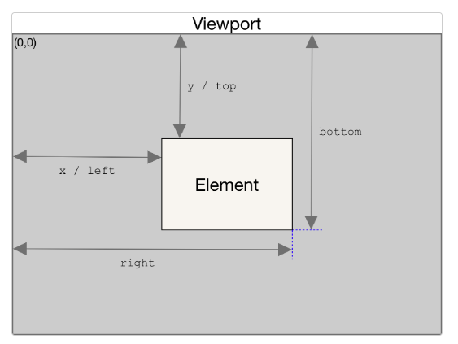

# TIL 230512 (금)

- React 스크롤 애니메이션
    ```javascript
    const [isVisible, setIsVisible] = useState(false);
    const scrollRef = useRef<HTMLDivElement>(null);

    const curElement = scrollRef.current;
    
    if (typeof window !== "undefined") {
    window.addEventListener("scroll", () => {
      if (curElement) {
        console.log(curElement.getBoundingClientRect().bottom);
        console.log(
          curElement.getBoundingClientRect().bottom <= screen.height
            ? "요소완전히스크롤됨"
            : "스크롤아직"
        );
        setIsVisible(
          curElement.getBoundingClientRect().bottom <= screen.height
        );
      }
    });
  }
  ``` 
  - window에 스크롤 이벤트를 추가
  - element.getBoundClientRect() : element의 크기와 뷰포트에서의 상대적인 위치 정보를 제공함
    
  - 요소의 끝까지 스크롤이 내려갔는지 확인하는 법
    ``` javascript
    element.getBoundingClientRect().bottom <= screen.height
    // 이 값이 true이면 요소의 끝까지 스크롤이 내려간 상태임
    ```
  - 요소의 끝까지 스크롤이 내려갔을 때 isVisible의 상태를 true로 바꾸어 원하는 작업을 하면 됨
  - TIP) 함수로 만들면 여러개 적용 가능함
    ```javascript
    function addScrollEvent({
      scrollRef,
      setIsVisible,
    }: {
      scrollRef: React.RefObject<HTMLDivElement>;
      setIsVisible: React.Dispatch<React.SetStateAction<boolean>>;
    }) {
      const curElement = scrollRef.current;
      window.addEventListener("scroll", () => {
        if (curElement) {
          setIsVisible(
            curElement.getBoundingClientRect().bottom <= screen.height
          );
        }
      });
    }

    useEffect(() => {
      addScrollEvent({ scrollRef: scrollRef1, setIsVisible: setIsVisible1 });
      addScrollEvent({ scrollRef: scrollRef2, setIsVisible: setIsVisible2 });
      addScrollEvent({ scrollRef: scrollRef3, setIsVisible: setIsVisible3 });
    }, []);
    ```

---
## 출처
- (스크롤 애니메이션) https://www.kindacode.com/article/react-get-the-position-x-y-of-an-element/
- (스크롤 애니메이션) https://velog.io/@dunde/Javascript-%EC%8A%A4%ED%81%AC%EB%A1%A4-%EC%9D%B4%EB%B2%A4%ED%8A%B8
- (스크롤 애니메이션) https://lookingfor.tistory.com/entry/%EC%9E%90%EB%B0%94%EC%8A%A4%ED%81%AC%EB%A6%BD%ED%8A%B8-%ED%99%94%EB%A9%B4-%ED%81%AC%EA%B8%B0-%EA%B5%AC%ED%95%98%EA%B8%B0