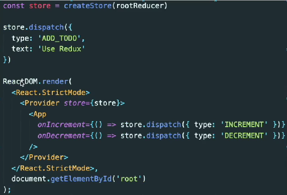

# TIL 230515 (월)

1. Redux
    - javascript의 상태관리 라이브러리
    - 동작 방식
        1. 컴포넌트에서 action을 dispatch함
        2. action은 reducer를 호출함
        3. reducer는 조건에 맞게 state를 업데이트함 (redux store)
        4. state가 변경되면 그 state를 가지고 있는 컴포넌트들이 조건에 맞게 리렌더링됨
    - `action`
        ```javascript
        {type: "UPDATE_USER_NAME", nickName: "ss"}
        ```
        - action은 javascript object로 dispatch는 action을 reducer에 보내는 작업을 의미함
        - `dispatch 사용법`
            ```javascript
            import {useDispatch} from 'react-redux';

            const App = () => {
                const dispatch = useDispatch();

                const onClick = () => {
                    dispatch({type: "INCREASE"})
                }
                
                return <>
                    <div onClick={onClick}>+</div>
                </>
            }
            ```
    - `reducer`
        ```javascript
        const counterReducer = (state, action) => {
            if(action.type === "INCREASE") {
                return state + 1;
            }else if (action.type === "DECREASE") {
                return state - 1;
            }
        }
        ```
        - reducer는 state와 action을 입력받아 action에 따라 state를 업데이트함
2. Redux Provider
    - `<Provider>`는 Redux Store 저장소에 액세스해야 하는 모든 중첩 구성 요소에서 Redux Store 저장소를 사용할 수 있도록 함
    
    - provider로 둘러 쌓인 컴포넌트에서 store에 접근하려면 useSelector와 useDispatch를 사용하면 됨
    - `useSelector` : store의 state를 가져옴
        ```javascript
        /// state의 counter state만 가져옴
        const counter = useSelector((state)=>state.counter)
        ```
    - `useDispatch` : store의 dispatch에 접근함
        ```javascript
        dispatch({ type:'ADD', text:"input"})
        ```
3. Redux middleware
    - action을 dispatch해서 reducer에 도달하는 순간, 그 사이에 사전에 지정된 작업을 실행할 수 있게 하는 중간자
    - 로깅, 충돌 보고, 비동기 API와의 통신, 라우팅 등을 위해 사용함
    
    - 예시) logger middleware (로깅 작업)
        ```javascript
        const loggerMiddleware = (store) => (next) => (action) => {
            console.log("store", store);
            console.log("action", action);
            next(action);
        }

        const middleware = applyMiddleware(loggerMiddleware);

        const store = createStore(rootReducer, middelware);
        ```
4. Redux Thunk
    - Redux를 사용하는 앱에서 비동기 작업을 할 때 많이 사용하는 Redux middleware
    - 'thunk'라는 단어는 '일부 지연된 작업을 수행하는 코드 조각'을 의미하는 프로그래밍 용어임
    - 예시 (위의 logger middleware에 이어서 작성됨)
        ```javascript
        useEffect(()=>{
            dispatch(fetchPosts())
        },[dispatch])

        const fetchPosts = () => {
            return async function fetchPostsThunk(dispatch, getState){
                const response = await axios.get("url주소");
                dispatch({ type: "FETCH", payload: response.data});
            }
        }

        // thunk를 사용하지 않고 위 코드를 실행하면 에러가 발생함
        // dispatch가 받는 action은 object이기 때문임
        // thunk는 함수를 인자로 받아 middleware로써 작동할 수 있게 함
        const middleware = applyMiddleware(thunk, loggerMiddleware);

        const store = createStore(rootReducer, middelware);
        ```
        
        - Redux Thunk는 받은 action이 객체인지 함수인지 판단해서 객체면 그대로 reducer에 보내고 함수면 전달받은 함수를 call함
5. Redux Toolkit
    - redux 로직을 작성하기 위한 공식 권장 접근 방식
    - redux 작업을 단순화하고 일반적인 실수를 방지하고 redux 애플리케이션을 더 쉽게 작성할 수 있도록 함
    - redux를 사용할 때 코드가 길어져서 라이브러리를 사용했는데, 사용하는 라이브러리 수가 많아져서 이를 통합하여 redux가 공식적으로 redux toolkit이라는 라이브러리를 만듦
    - redux-actionm reselect, redux-thunk, immer의 produce 등의 기능을 지원함
---
## 출처
- 인프런 강의 (따라하며 배우는 리액트, 파이어베이스 - 채팅 어플리케이션 만들기)
- (redux) https://ringle.notion.site/8fe54b118a06463a9112d97aab07b4b7
